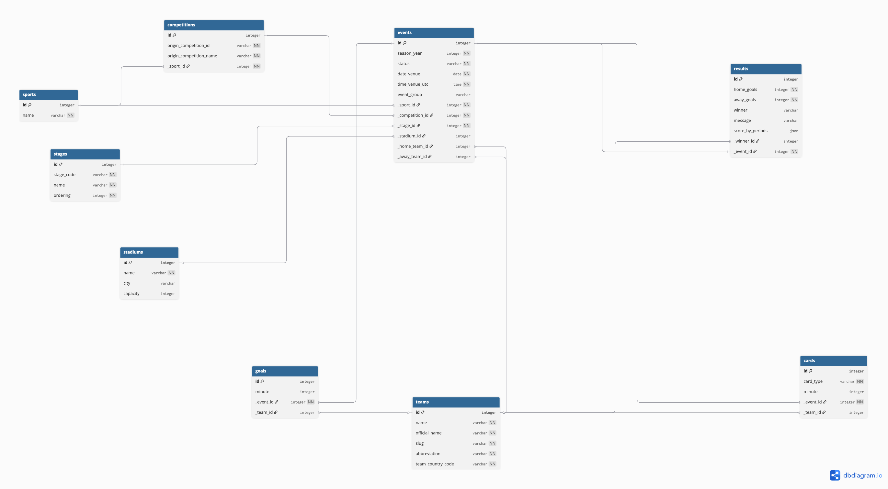

# Sports Event Calendar — Sportradar Coding Academy 2026

Project created by **Mateusz Siara** as part of the Sportradar Coding Academy 2026 recruitment process.

A web application for browsing and managing sports events. Data comes from the AFC Champions League 2024 dataset provided by Sportradar.

---

## Tech Stack

- **Java 21** + **Spring Boot 3.5** — backend
- **PostgreSQL 16** — database
- **Liquibase** — database migrations
- **Spring Data JPA** — database access
- **Thymeleaf** — HTML templates
- **Lombok** — reduces boilerplate code
- **Docker** — database container
- **Maven** — build tool

---

## How to Run

### Requirements
- Java 21
- Maven
- Docker Desktop

### Steps

**1. Clone the repository**
```bash
git clone https://github.com/MateuszSiara/sports-calendar.git
cd sports-calendar
```

**2. Start the database**
```bash
docker-compose up -d
```

**3. Run the application**
```bash
./mvnw spring-boot:run
```

**4. Open in browser**
```
http://localhost:8080/events
```

Liquibase will automatically create all tables and insert the AFC Champions League 2024 sample data.

> Note: The database runs on port 5433 instead of the default 5432, because port 5432 was already in use on my machine. If you have the same issue, change the port in both `docker-compose.yml` and `application.properties`.

---

## Database Design

The schema follows **Third Normal Form (3NF)** — no redundancy, no transitive dependencies.

### ERD



### Tables

| Table | Description |
|-------|-------------|
| `sports` | Sport categories (e.g. Football) |
| `competitions` | Leagues and competitions (e.g. AFC Champions League) |
| `stages` | Tournament stages (e.g. Round of 16, Final) |
| `stadiums` | Venue details — name, city, capacity |
| `teams` | Team information |
| `events` | Central table — matches with date, time and status |
| `results` | Match results — separate table, only exists when a match has been played |
| `goals` | Goals — separate table following 3NF |
| `cards` | Cards (yellow, red) — one table with a `card_type` field |

---

## Architecture

The application uses a **layered architecture** with SOLID principles:

```
Browser
   ↓
Controller   — handles HTTP requests
   ↓
Service      — business logic (interface + implementation)
   ↓
Repository   — database access
   ↓
Model        — JPA entities
   ↓
DTO          — objects returned to the view
```

---

## Endpoints

| Method | URL | Description |
|--------|-----|-------------|
| GET | `/events` | List all events |
| GET | `/events/{id}` | Single event details |
| GET | `/events/new` | Add event form |
| POST | `/events` | Save new event |

---

## Sample Data

5 AFC Champions League 2024 matches from the provided dataset:

| Date | Home | Away | Stage | Status | Result |
|------|------|------|-------|--------|--------|
| 2024-01-03 | Al Shabab | Nasaf | Round of 16 | Played | 1:2 |
| 2024-01-03 | Al Hilal | Shabab Al Ahli | Round of 16 | Scheduled | — |
| 2024-01-04 | Al Duhail | Al Rayyan | Round of 16 | Scheduled | — |
| 2024-01-04 | Al Faisaly | Foolad | Round of 16 | Scheduled | — |
| 2024-01-19 | TBD | Urawa Reds | Final | Scheduled | — |

---

## Design Decisions

**Why PostgreSQL instead of H2?**
H2 is an in-memory database — data disappears after every restart. PostgreSQL is what real systems use. I wanted to show that I can work with a real database environment, not just a simplified solution made for testing purposes.

**Why Spring Boot?**
It's the technology I know best and have used in my personal projects. Using Spring Boot allowed me to focus more on solving the actual problem rather than spending time on configuration. The Spring ecosystem (JPA, Liquibase, Thymeleaf) also works really well together, which made it the best choice in my opinion.

**Why DTOs instead of JPA entities directly?**
JPA entities contain fields that the view doesn't need. A DTO is a clean object with exactly the fields needed for the view — nothing more. This way the presentation layer is separated from the data layer. Changes to the database structure don't require changes to the view.

**Why an interface in the service layer?**
This is the Dependency Inversion Principle from SOLID. The controller depends on the `EventService` interface, not on the concrete `EventServiceImpl` class. This means you can swap the implementation without changing the controller — for example in tests, a mock can be injected instead of the real service. You can see this in the tests where `@MockitoBean` replaces the implementation with a fake one.

**Why Liquibase instead of `ddl-auto`?**
`spring.jpa.hibernate.ddl-auto=create` drops and recreates tables on every restart — you lose all data. `ddl-auto=update` tries to update the schema but can break a production database. Liquibase runs each migration exactly once, remembers what has already been executed, and lets you track the history of schema changes. It's the standard approach in every production project.

**Why JOIN FETCH in the repository?**
Without JOIN FETCH, Hibernate executes a separate query for each relation on each event (N+1 problem, which the task explicitly said to avoid). For 5 events with 6 relations each, that would be over 30 queries instead of one.

**Why is `results` a separate table?**
Scheduled matches don't have a result yet. Storing `home_goals` and `away_goals` in the `events` table would mean NULL values for unplayed matches — a violation of 3NF because those fields would depend on the status, not the primary key. A separate `results` table means the result simply doesn't exist until the match is played.

**Why one `teams` table instead of separate home/away tables?**
A team can be the home side today and away next week. Having separate `home_teams` and `away_teams` tables would mean Al Shabab exists twice in the database. One `teams` table with `_home_team_id` and `_away_team_id` foreign keys eliminates redundancy and follows 3NF.

**Why does `cards` use a `card_type` field?**
Instead of three separate tables (`yellow_cards`, `second_yellow_cards`, `direct_red_cards`), one `cards` table with a `card_type` field handles all types. Adding a new card type only requires a new value in the field — no schema changes, no code changes. This is the Open/Closed Principle from SOLID.